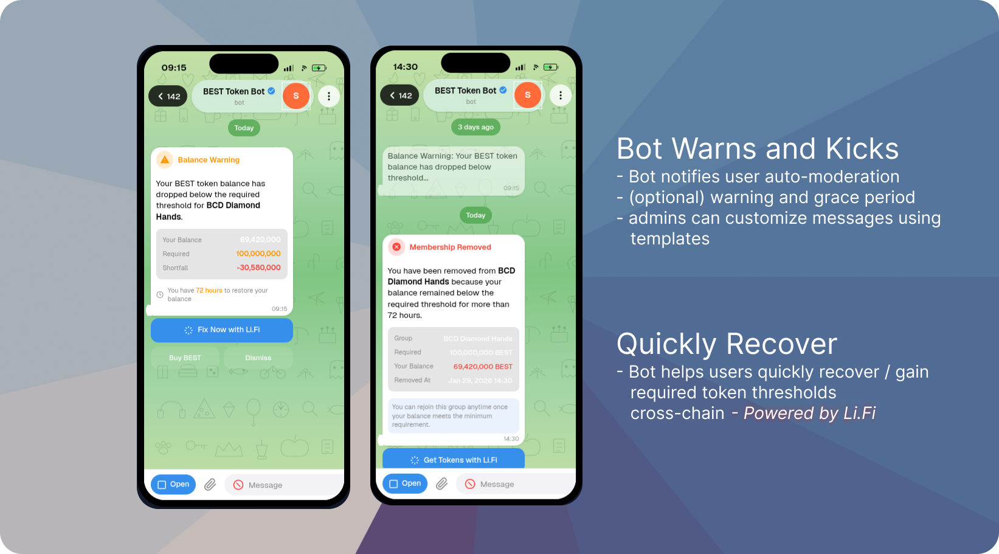
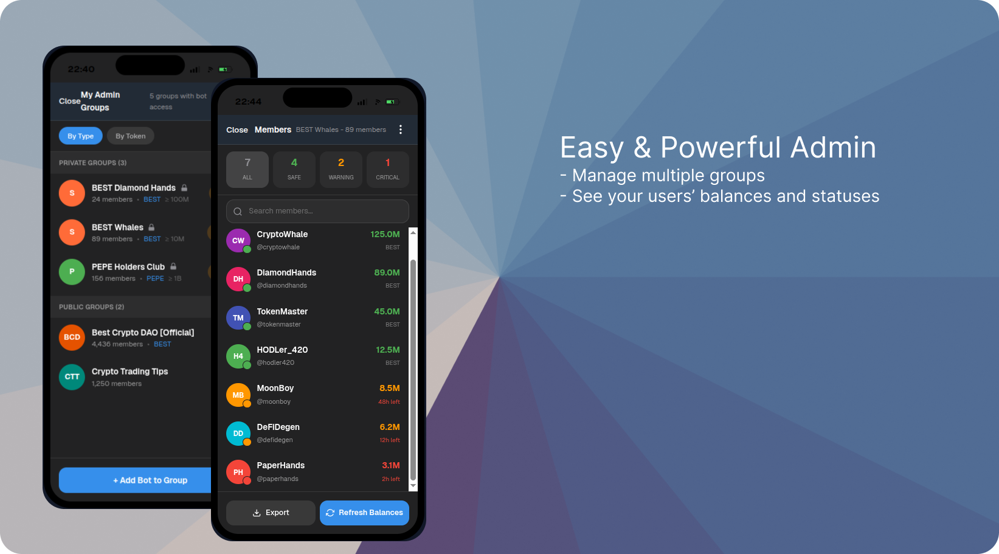
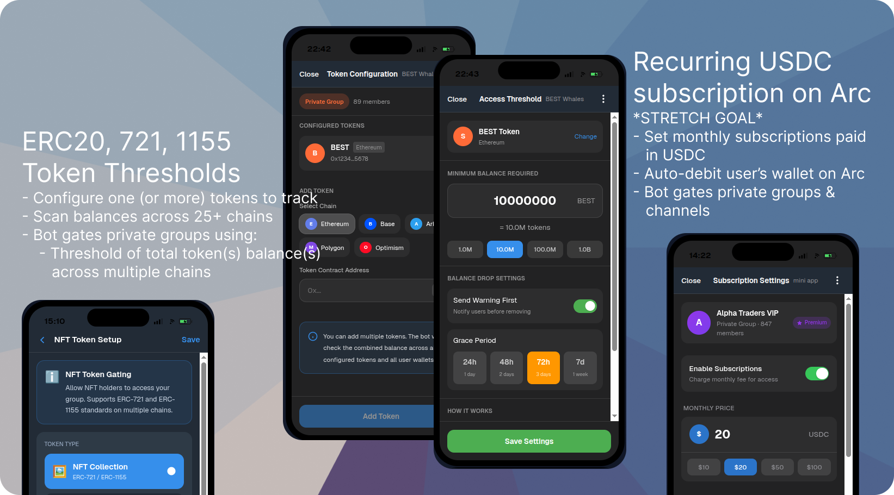

# Gater Robot

**Telegram private communities: *Token-gated by Gater Robot***

  <h4>Scan to open</h4>
  

    
    
  

  
  <!--  -->
  <h5> 
    Get Started - Open Telegram:
  </h5>
  

    <a href="https://t.me/gaterrobot" target="_blank">@GaterRobot</a>
  

---

# The Hackathon Process
> [!TIP]
> Expand each section to peek into the Hack-a-thon process -- see our work progress from idea to (hopefully) reality.

<h2> 
    Step 0: The Idea
</h2>

<h4>
  Figma Demo Screens
</h4>

---

<h2> 
    Step 1: Brainstorm User Journies
</h2>

<h4>
  V0 Mocking User Jouries
</h4>

View live demo screens:
[gater-journey.agentix.bot](https://gater-journey.agentix.bot/)

---

<h2> 
    Step 2: Project Planning
</h2>

<h4>
  Tracking workstreams across team and repos using GitHub projects.
</h4>

> Orchestrating project, milestones, issues, and PRs using `gh` cli (and Claude Code)

> [!TIP]
> View llive project board as we crush tasks: 
> [Gater Robot | EthGlobal 2026 HackMoney Async Hackathon](https://github.com/orgs/Gater-Robot/projects/1)

---

<h2> 
    Step 3: PoC Implementaion - User
</h2>

<h4>
  Initial /user mini-app onboarding and bot interactions
</h4>

---

[Gater Robot | Homepage](https://gater.agentix.bot)

**Get Started - Open Telegram:**

[@GaterRobot](https://t.me/gaterrobot)

<!--

**Here are some ideas to get you started:**

🙋‍♀️ A short introduction - what is your organization all about?
🌈 Contribution guidelines - how can the community get involved?
👩‍💻 Useful resources - where can the community find your docs? Is there anything else the community should know?
🍿 Fun facts - what does your team eat for breakfast?
🧙 Remember, you can do mighty things with the power of [Markdown](https://docs.github.com/github/writing-on-github/getting-started-with-writing-and-formatting-on-github/basic-writing-and-formatting-syntax)
-->
